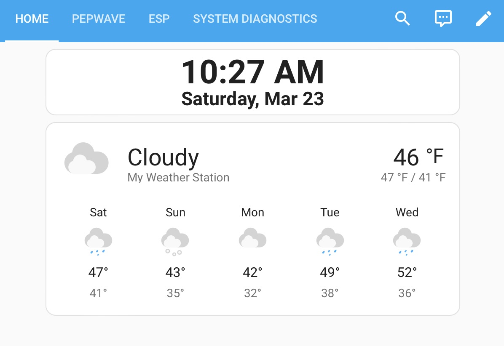

# **My Weather Station**


The weather service integrations that I tried in HA all seem to use the location that is defined during installation for weather data. This doesn't really work on a "home" that moves. This weather station is built using the Rest sensor platform in HA to get the weather data from Open Weather Map. Using the Rest platform enables youe change your location for the weather. All that ones needs to do is update the zone to your current location.

My Weather Station configuration is defined with 2 files:
- The sensors/weather.yaml file contains the configuration for the rest Open Weather Map sensor.
- The my-weather-station.yaml file maps the data from the Open Weahter Map service to the HA Weather object

You need an API key, which is free, but requires a [registration](https://home.openweathermap.org/users/sign_up). Then update the second line in the *sensors/weather.yaml* file for your App ID

```
resource_template: "https://api.openweathermap.org/data/2.5/onecall?lat={{state_attr('zone.home', 'latitude')}}&lon={{state_attr('zone.home', 'longitude')}}&units=imperial&appid=`<your appid>`"*
```

I’ve split up my configuration into multiple files to help keep it a bit more manageable. My Sensor configuration is stored in a sensors folder with multiple files for different sensor definitions. If you use this approach then you can include the files for the weather station by including the following in your configuration.yaml file.

```
sensor: !include_dir_merge_list sensors
weather: !include my-weather-station.yaml
```

I created this script that I can run when I want to update the location of my "home" zone. It uses the location of a pepwave router that is scanned by HA.

```
alias: Update Home Location
sequence:
  - service: homeassistant.set_location
    data:
      latitude: "{{ state_attr('sensor.pepwave_gps', 'latitude') }}"
      longitude: "{{ state_attr('sensor.pepwave_gps', 'longitude') }}"
  - service: homeassistant.update_entity
    data: {}
    target:
      entity_id: sensor.owm_report
  - service: system_log.write
    data:
      level: warning
      message: Location Updated
mode: single
icon: mdi:weather-sunny-alert
```
