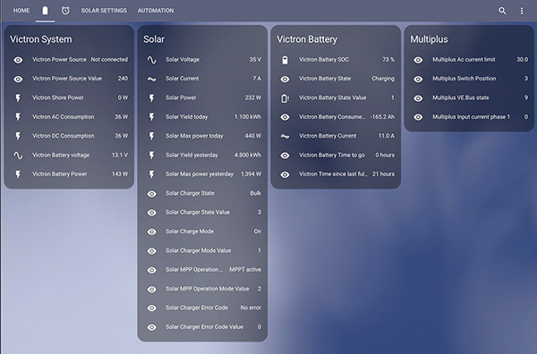

# **Victron Modbus Configuration**

Configuration for the Victron Energy components, MultiPlus, BMV-702, BlueSolar MPPT in Home Assistant.
Below are the Victron sensors implemented by the configuration files.



The Modbus configuration is defined with 2 files:
- The victron-modbus.yaml file contains the configuration for the Modbus regesters
- The VictronValueMapping.yaml file (located in the templates folder) maps numeric values to user friendly textual values. Like the solar charger on/off value of 1 or 4 to On or Off

Together these files implement the Victron Energy values I’m currently using in my HA setup. By using separate files I'm able to keep the main HA configuration file cleaner. You will see below that I am using the dir_merge_list capability so that I can have multiple "template" files to keep functionality separate as my HA capability is expanded.

To include these files you need to add the following to your configuration.yaml
```
# Modbus
modbus: !include victron-modbus.yaml
        
template: !include_dir_merge_list templates
```

The Modbus device address are defined as entries in the HA secret file. Create an entry for each Modbus device like: 
```
# Use this file to store secrets like usernames and passwords.
# Learn more at https://www.home-assistant.io/docs/configuration/secrets/
# victron
com.victronenergy.system: 100
com.victronenergy.battery: 245
com.victronenergy.vebus: 246
com.victronenergy.solarcharger: 247

```
Download the Modbus-TCP register list at:
[Victron Energy Technical Information](https://www.victronenergy.com/support-and-downloads/technical-information)
